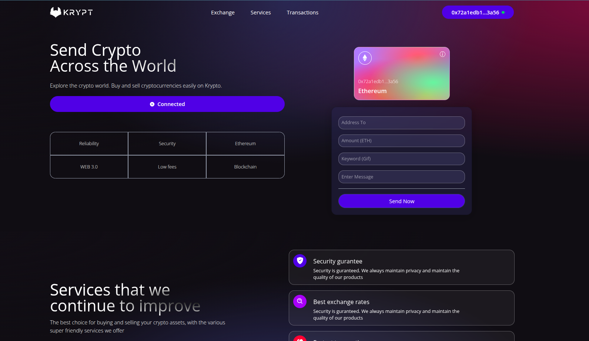

# BlockForge



BlockForge is a full-stack blockchain application that combines a modern web client with robust smart contract development. The project leverages [Foundry](https://github.com/foundry-rs/foundry) and Forge Standard Library for smart contract testing and deployment, and uses a TypeScript/React frontend for seamless user interaction.

---

## Features

- **Smart Contract Development:**  
  Write, test, and deploy Solidity smart contracts using Foundry and Forge Standard Library.

- **Modern Web Client:**  
  React-based frontend with TypeScript, Vite, and custom hooks for interacting with blockchain contracts.

- **Full Testing Suite:**  
  Integrated unit tests for smart contracts logic.

- **Developer Experience:**  
  Hot reloading, linting, and type checking for rapid development.

---

## Project Structure

```plaintext
blockForge.png
client/
  ├── src/
  ├── public/
  ├── hooks/
  └── ...
smart_contract/
  ├── src/
  ├── test/
  ├── lib/
  └── ...
```

- **client/**: Frontend React application.
- **smart_contract/**: Solidity contracts, tests, and Foundry configuration.

---

## Getting Started

### Prerequisites

- [Node.js](https://nodejs.org/)
- [Foundry](https://book.getfoundry.sh/getting-started/installation)

### Setup

#### 1. Install Frontend Dependencies

```sh
cd client
npm install
```

#### 2. Run the Frontend

```sh
npm run dev
```

#### 3. Install Foundry & Dependencies

```sh
cd ../smart_contract
forge install
```

#### 4. Build & Test Smart Contracts

```sh
forge build
forge test
```

---

## Contributing

Contributions are welcome! Please see the [smart_contract/lib/forge-std/CONTRIBUTING.md](smart_contract/lib/forge-std/CONTRIBUTING.md) for guidelines.

---

## License

This project is licensed under MIT or Apache 2.0. See [smart_contract/lib/forge-std/README.md](smart_contract/lib/forge-std/README.md) for details.
